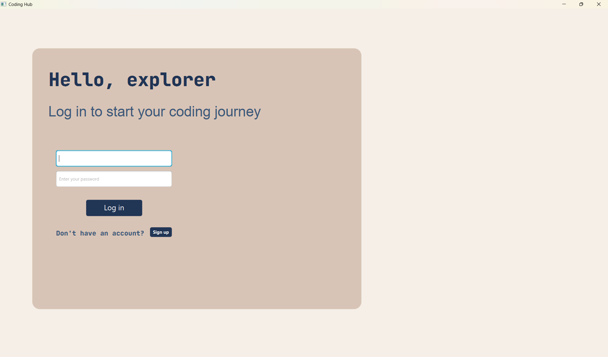
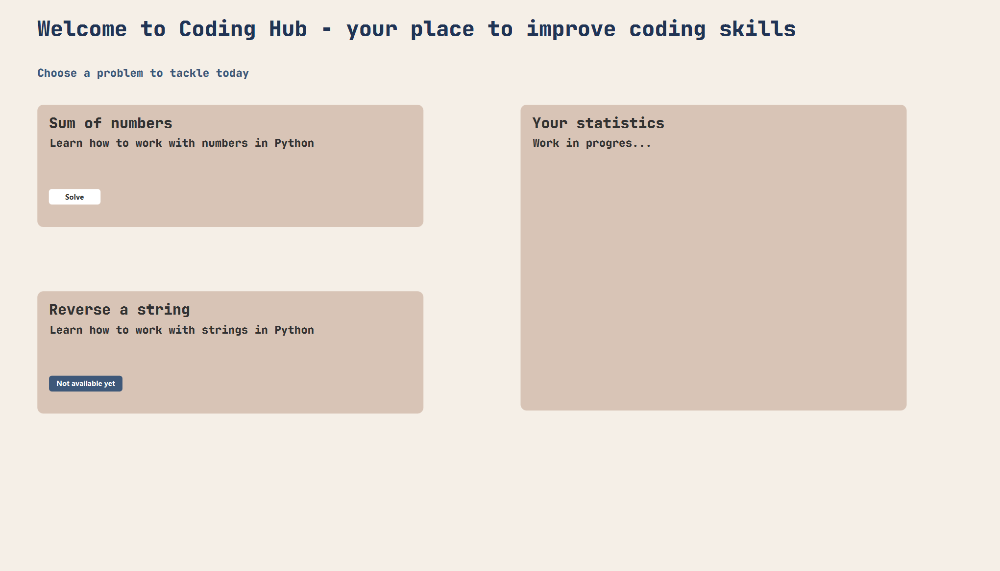
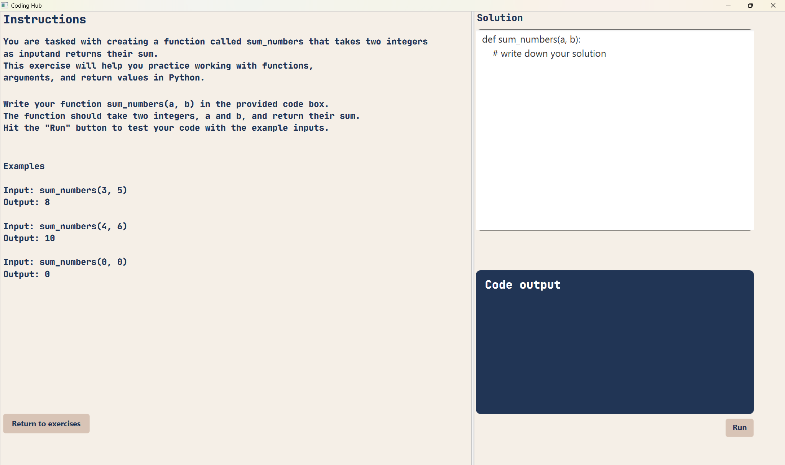

# Coding-Hub
A platform where developers can improve coding skills

It is a Desktop Application with:

- An **authentification** system,
- A **home screen** with all exercises,
- For **each exercise** a different screen that contains a **description** of the problem, **instructions** and **examples**

## Landing page

## Home page

## Exercise page

## 🛠️ Tech stack
- Java
- MySQL Database